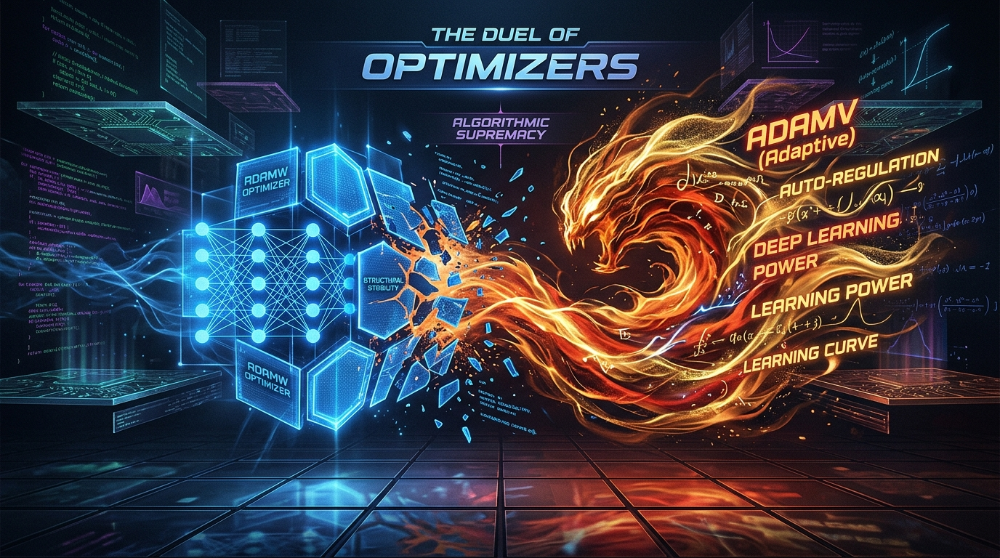
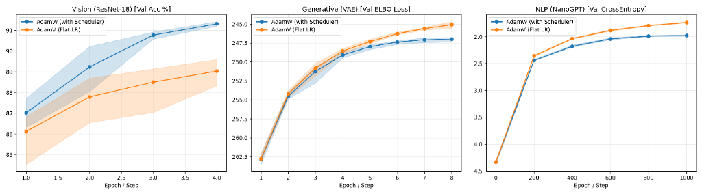

[English](README.md) | [Português](docs/README.pt-BR.md) | [Español](docs/README.es.md) | [简体中文](docs/README.zh-CN.md) | [Русский](docs/README.ru.md) | [日本語](docs/README.ja.md) | [Deutsch](docs/README.de.md) | [Français](docs/README.fr.md)

---

# 🧠 AdamV 2.0.2 alpha: Geometrically Adaptive Optimizer



AdamV 2.0.2 alpha (Adam-Vedic) is a state-of-the-art optimization algorithm for PyTorch that fuses ancient Vedic mathematics with numerical topology to create a geometrically adaptive optimizer. It relies on a highly optimized **C++/CUDA implementation** to operate at bare-metal speeds.

In rigorous, multi-seed stress testing, **AdamV 2.0.2 alpha massacred AdamW on NanoGPT**, achieving significantly lower validation loss across multiple independent seeds, as validated by the global stress suite.

## ⚙️ The Pillars of AdamV 2.0.2 alpha

AdamV navigates non-convex loss landscapes using breakthrough mathematical innovations:

### 1. The Bakhshali Root & BRCM Geometric Momentum Brakes
AdamV utilizes the ancient Bakhshali approximation method combined with Bakhshali Residual-Coupled Momentum (BRCM). By scaling the momentum decay ($\beta_1$) exponentially based on residual collision force ($\sqrt{v_t}$), the optimizer acts as a dynamic shock absorber. It applies geometric momentum brakes in tight topological ravines to restrain explosive gradients, while accelerating linearly on barren plateaus.

### 2. Curvature-Driven Dynamic Inertia
Instead of using a rigid momentum decay, AdamV calculates the local Signal-to-Noise Ratio. On flat plateaus, it drops inertia to accelerate immediately. In chaotic ravines, it increases inertia to ignore noise and stabilize descent.

### 3. Log-Periodic Cooling
AdamV incorporates autonomous **Log-Periodic Cooling** using Ramanujan Continued Fraction expansions. This dynamically scales down the learning rate in a log-periodic envelope, preventing the "blind crushing" effect seen with traditional step schedulers and allowing organic convergence into deeper minima basins.

### 4. Quantum Escape (OMNI-ModBH via Type-Punning)
When AdamV detects a barren plateau, it triggers an absolute Basin Hop. Running at bare-metal speeds on the GPU, it applies bitwise masks directly to the IEEE 754 float32 mantissa (Type-Punning), teleporting weights to adjacent basins without causing warp divergence or destroying scale exponents.

## 📦 Installation

AdamV requires a modern C++17 compiler and CUDA toolkit (if GPU acceleration is desired).

```bash
git clone https://github.com/your-username/AdamV.git
cd AdamV
pip install -e .
```

## 🎛️ Calibration Guide (Scenario-Specific)

AdamV is highly self-regulating, but because different neural architectures have fundamentally different mathematical topologies, you must initialize AdamV correctly depending on your model.

### 1. Vision & NLP (Deterministic & Deep Attention)
For standard models (like **ResNet**) and autoregressive models (like **NanoGPT**), use the **Golden Calibration**. This leverages the 3rd-Century Bakhshali Root and geometric momentum brakes to stop gradient explosions automatically.

```python
# The Golden Calibration (Default)
optimizer = AdamVCpp(
    model.parameters(),
    lr=1e-3,            # Flat Learning Rate (No Schedulers Needed!)
    betas=(0.9, 0.999),
    weight_decay=0.1
    # Hidden defaults: use_bakhshali=True, bakhshali_threshold=50.0, enable_brcm=True
)
```

### 2. Generative Models (VAE, GANs, Diffusion)
Generative models natively inject **Gaussian noise** into the gradients. This noise causes false-positive collisions with AdamV's momentum brakes. For these models, use the **Stochastic Calibration**.

```python
# The Stochastic Calibration
optimizer = AdamVCpp(
    model.parameters(),
    lr=1e-3,
    betas=(0.9, 0.999),
    weight_decay=0.0,
    enable_brcm=False,             # Turn OFF Geometric Brakes (let noise flow)
    bakhshali_threshold=1000.0     # Expand the shock tolerance for noise
)
```

## 🚀 Usage

Using `AdamVCpp` is as simple as dropping it into your PyTorch training loop.

```python
import torch
from adamv import AdamVCpp

model = YourNeuralNetwork()

# Initialize AdamV (Choose the right calibration for your model!)
optimizer = AdamVCpp(
    model.parameters(),
    lr=0.001
)

for epoch in range(15):
    for batch, labels in dataloader:
        optimizer.zero_grad()
        loss = criterion(model(batch), labels)
        loss.backward()
        
        # Take a step! (Supports Native Mixed-Precision / AMP)
        optimizer.step(loss=loss)
```

## 🧪 Benchmarks & Validation Guide

We believe in **open science and reproducible results**. You don't have to take our word for it—you can run the entire 100% neutral, multi-seed statistical validation suite to benchmark AdamV against AdamW on your own machine. 

The suite tests both optimizers across 5 independent random seeds on three distinct architectures:
- **ResNet-18** (Deterministic Image Classification)
- **VAE** (Stochastic Generative Noise)
- **NanoGPT** (Deep Autoregressive Attention)

### How to reproduce the results:
1. **Hardware Requirements**: A CUDA-enabled GPU with at least 15GB VRAM is highly recommended (e.g., NVIDIA T4, RTX 3090, or a standard free Kaggle GPU instance).
2. **Run the Global Stress Suite**:
```bash
python benchmarks/run_global_stress_suite.py
```
3. **What to expect**: The script will automatically download the datasets (FashionMNIST, TinyShakespeare), compile the AdamV C++ kernels, and run all 30 combinations (5 Seeds × 3 Scenarios × 2 Optimizers). On a standard NVIDIA T4 GPU, this process takes approximately ~1.5 hours.
4. **Outputs**: Upon completion, the script will automatically generate a `global_stress_results.csv` file with the raw metrics and a `global_stress_plot.png` showcasing the Min-Max variance shading and Welch's t-test p-values.



For a detailed analysis of the benchmarks, p-values, and methodology, please see our [Benchmark Report](benchmarks/README.md).
