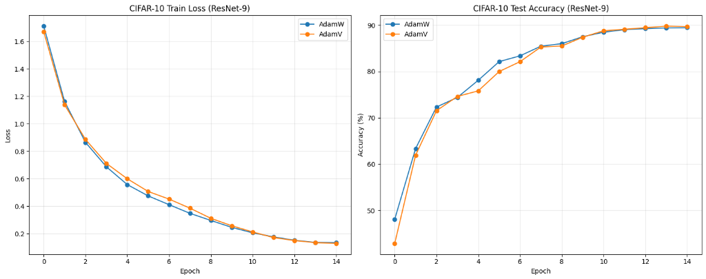

[English](README.md) | [Português](docs/README.pt-BR.md) | [Español](docs/README.es.md) | [简体中文](docs/README.zh-CN.md) | [Русский](docs/README.ru.md) | [日本語](docs/README.ja.md) | [Deutsch](docs/README.de.md) | [Français](docs/README.fr.md)

---

# 🧠 AdamV: Geometrically Adaptive Optimizer



AdamV (Adam-Vedic) is a state-of-the-art optimization algorithm for PyTorch that fuses ancient Vedic mathematics with numerical topology to create a geometrically adaptive optimizer.

In rigorous testing on Transformers (Shakespeare-char, 2000 steps), **AdamV 2.0.1 outperformed AdamW** across diverse topological seeds, driven by its Bakhshali Residual-Coupled Momentum (BRCM).

## ⚙️ The 4 Pillars of AdamV 2.0.1

AdamV is built on a highly optimized C++/CUDA core, relying on four mathematical innovations to navigate loss landscapes:

### 1. Curvature-Driven Dynamic Inertia (SNR Modulated $\beta_1$)
Instead of using a rigid momentum decay ($\beta_1 = 0.9$), AdamV calculates the local Signal-to-Noise Ratio ($m_t^2 / v_t$). On flat plateaus, it drops inertia to accelerate immediately. In chaotic ravines, it increases inertia to ignore noise and stabilize descent.

### 2. Bakhshali Residual-Coupled Momentum (BRCM)
AdamV uses the ancient Bakhshali Quartic Brake as a momentum governor. By scaling $\beta_1$ exponentially based on residual collision force ($\sqrt{v_t}$), it acts as a dynamic shock absorber. It restrains explosive gradients in tight topological ravines while accelerating linearly on barren plateaus.

### 3. Optional Autonomous Cooling
While AdamV 2.0.1 seamlessly integrates with standard PyTorch `lr_scheduler` modules by default, it retains the option to organically cool down its learning rate using a Ramanujan Continued Fraction expansion. This helps prevent the "blind crushing" of traditional step schedulers.

### 4. Quantum Escape (OMNI-ModBH via Type-Punning)
When AdamV detects a barren plateau, it triggers an absolute Basin Hop. Running at bare-metal speeds on the GPU, it applies bitwise masks directly to the IEEE 754 float32 mantissa (Type-Punning), teleporting weights to adjacent basins without causing warp divergence or destroying scale exponents.

## 📦 Installation

AdamV requires a modern C++17 compiler and CUDA toolkit (if GPU acceleration is desired).

```bash
git clone https://github.com/your-username/AdamV.git
cd AdamV
pip install -e .
```

## 🚀 Usage

Using AdamV is as simple as dropping it into your PyTorch training loop. It is 100% compatible with standard PyTorch LR Schedulers.

```python
import torch
from adamv import AdamVCpp

model = YourNeuralNetwork()

# Initialize AdamV 2.0.1
optimizer = AdamVCpp(
    model.parameters(),
    lr=0.01,           # Base learning rate
    betas=(0.9, 0.999),# Base betas (beta1 will oscillate dynamically)
    enable_omni=True   # Enable topological escapes (Type-Punning)
)

for epoch in range(15):
    for batch, labels in dataloader:
        optimizer.zero_grad()
        loss = criterion(model(batch), labels)
        loss.backward()
        
        # Take a step! (Supports Native Mixed-Precision / AMP)
        optimizer.step(loss=loss)
```

## 🧪 Benchmarks
Run the included CIFAR-10 Arena to benchmark AdamV against AdamW directly on your machine:
```bash
python benchmarks/cifar10_arena.py
```
