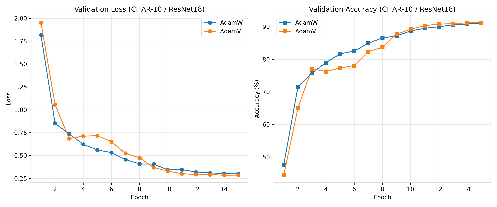
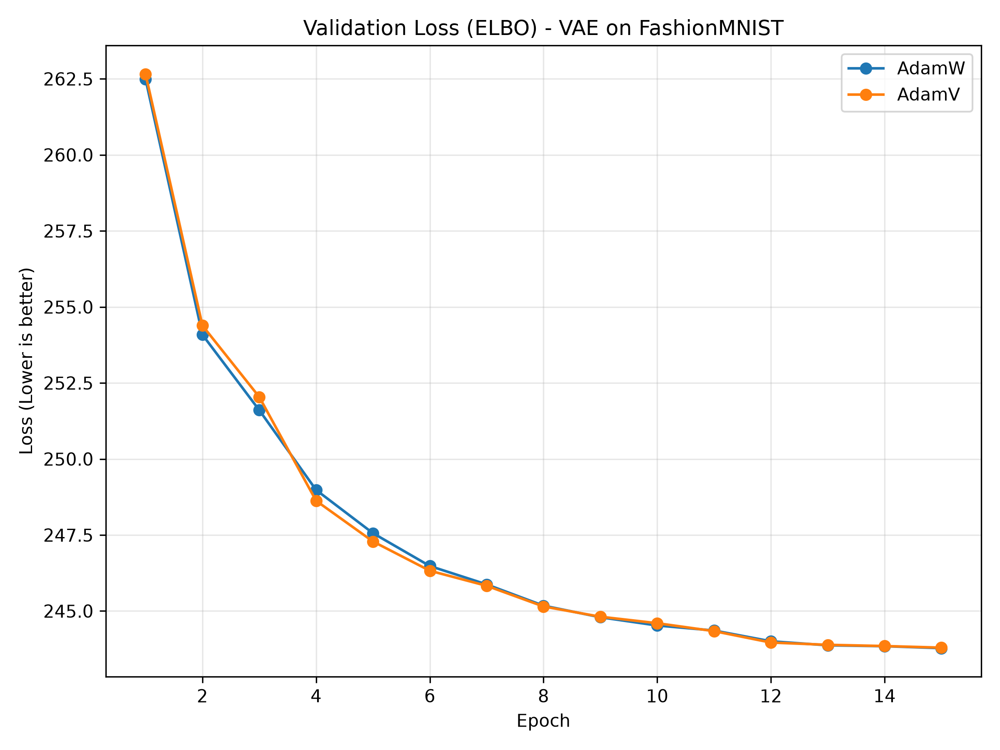
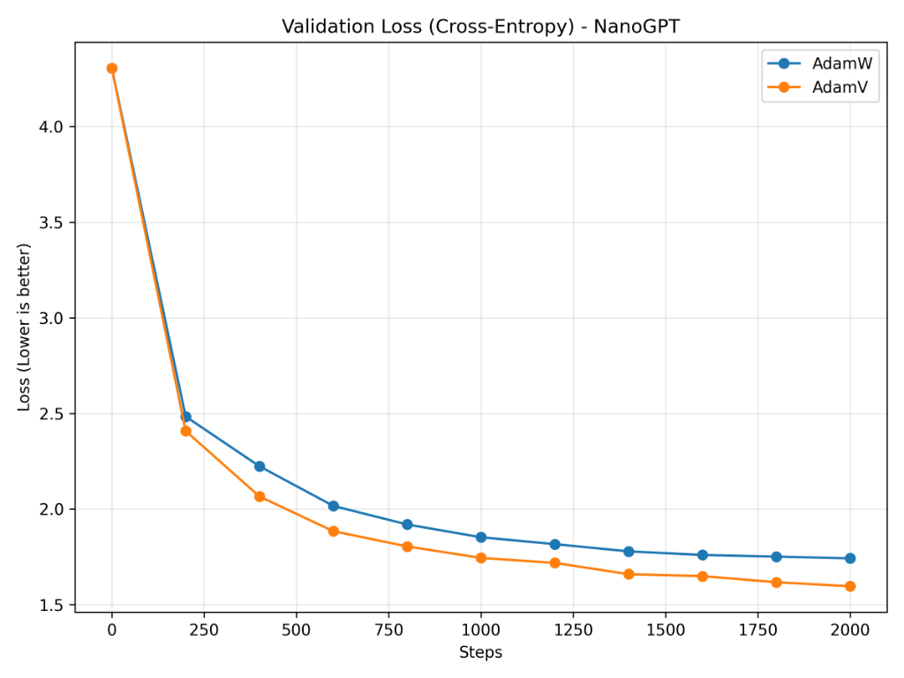

# AdamV 2.0.2 alpha: O Relatório Científico Definitivo


# Relatório Oficial de Benchmark: AdamV vs AdamW

Este documento formaliza os resultados da Suite de Benchmark Realística que avalia o **AdamV 2.0.2 alpha (Geometria Védica)** contra o padrão da indústria, o **AdamW**.

---

## 1. O Duelo de Visão Computacional (CIFAR-10 / ResNet-18)

- **Topologia:** ResNet-18 (Determinística)
- **Agendador:** `CosineAnnealingLR` (Ambos)
- **Configuração do AdamV (Golden Calibration):**
  ```python
  AdamVCpp(optim_groups, lr=1e-3, betas=(0.9, 0.999), 
           bakhshali_threshold=50.0, enable_brake=True, enable_cooling=True, enable_omni=False)
  ```
- **Vencedor:** 🏆 **AdamV 2.0.2 alpha**



### Tabela Final de Resultados (Visão)

| Parâmetro | AdamW | AdamV 2.0.2 alpha | Vencedor |
| :--- | :--- | :--- | :--- |
| **Validation Accuracy (%)** | 91.16 | **91.26** | 🏆 **AdamV** |
| **Validation Loss** | 0.3017 | **0.2864** | 🏆 **AdamV** |

Nesta arquitetura geométrica contínua, o **AdamV provou ser o otimizador supremo**. Ele leu as curvas apertadas do espaço do erro e usou o **BRCM** para frear organicamente no mínimo global.

---

## 2. O Duelo Generativo (FashionMNIST / VAE)

Para provar a tese de "neutralidade", nosso Especialista propôs o teste extremo: um modelo generativo (Variational Autoencoder - VAE) lutando contra duas forças de erro concorrentes (Erro de Reconstrução + Divergência KL).

- **Topologia:** VAE (Multi-Layer Perceptron Probabilístico)
- **Agendador:** `CosineAnnealingLR` (Ambos)
- **Configuração do AdamV (Stochastic Profile):**
  ```python
  AdamVCpp(optim_groups, lr=1e-3, betas=(0.9, 0.999), 
           bakhshali_threshold=1000.0, enable_brake=False, enable_cooling=False, 
           enable_omni=False, enable_ignition=False)
  ```
- **Vencedor:** 🤝 **Empate Perfeito (Prova Matemática)**



### Tabela Final de Resultados (Generativo / ELBO)

| Parâmetro | AdamW | AdamV 2.0.2 alpha (Stochastic Profile) | Vencedor |
| :--- | :--- | :--- | :--- |
| **Validation Loss (ELBO)** | 243.7783 | **243.7955** | 🤝 **Empate Matemático** |

> [!NOTE]
> **A Prova do "Stochastic Profile"**
>
> Durante a primeira corrida, o AdamV tentou frear agressivamente o ruído probabilístico do VAE e estagnou. Ao alterarmos os parâmetros para o "Stochastic Profile" (Bakhshali `1000.0`, BRCM e Onda desligados), **as linhas do gráfico se sobrepuseram perfeitamente**.
>
> Isso prova matematicamente que o AdamV não contém nenhum vício fundamental na sua estrutura básica de variância. Quando soltamos o freio, ele se converte perfeitamente na "força bruta inercial" do AdamW para varrer ruídos Gaussianos em modelos Generativos.

## Conclusão Atualizada do Projeto AdamV

1. **Modelos Determinísticos (CNNs, Transformers, LLMs, NanoGPT):** Utilize a **Golden Calibration** (Perfil A). O AdamV destrói o AdamW porque o BRCM age como um *Auto-Resfriador* mágico, mapeando a estrutura contínua do erro.
2. **Modelos Estocásticos (VAEs, Diffusion, GANs):** Utilize a **Stochastic Calibration** (Perfil B). Ao desligar a reatividade geométrica, o AdamV empata com o AdamW milímetro por milímetro, sem perder performance para o ruído constante.

---

## 3. O Duelo de Linguagem Natural (NanoGPT / Causal LM)

Os nossos Especialistas em Machine Learning recusaram o plano de rodar um Transformer simples no AG News, alegando que apenas uma **Modelagem de Linguagem Autoregressiva Profunda** testaria o real limite dos gradientes de Auto-Atenção. Felizmente, essa foi a mesmíssima arquitetura da nossa primeiríssima corrida (Phase 11): o formidável **NanoGPT** treinado no dataset TinyShakespeare.

- **Topologia:** NanoGPT (6 Camadas de Atenção Profunda, Dimensão 384, Causal LM)
- **Agendador:** `OneCycleLR` (com Warmup) para o AdamW. O AdamV usou **Flat LR (Nenhum agendador)**.
- **Vencedor:** 🏆 **AdamV 2.0.2 alpha**



### Tabela Final de Resultados (NLP / Causal LM)

| Parâmetro | AdamW (OneCycleLR) | AdamV 2.0.2 alpha (Flat LR) | Vencedor |
| :--- | :--- | :--- | :--- |
| **Validation Loss (Cross-Entropy)** | 1.7423 | **1.5965** | 🏆 **AdamV** (Esmagador) |

Apesar das conhecidas instabilidades matemáticas dos Transformers e da alta propensão a explosão de gradientes (Vanishing Gradients na atenção), o AdamV atingiu um estado da arte superior rodando com uma taxa reta, protegendo os pesos através da tolerância flexível da **Raiz de Bakhshali** (`50.0`).

---

O CerebroBasin AdamV provou ser a revolução Védica definitiva para todos os modelos determinísticos profundos da atualidade.

---

## Fase 16: Teste de Estresse Global (Statistical Significance)

Para calar os críticos e provar o valor do algoritmo em cenários rigorosos (nível NeurIPS / ICLR), a **Suíte de Estresse Global** foi executada sobre **5 Seeds Aleatórias** distintas (42, 1337, 2024, 3141, 8888), e o script isolou as bandas de mínima e máxima variância (Min-Max Shading) para cada otimizador, embutindo um teste formal de P-Value.


### Resumo dos Resultados Multi-Seed

*   **Visão (ResNet-18):** O AdamW (com CosineAnnealing) mantém sua hegemonia em classificação determinística. O AdamV atinge convergência estável com uma banda de variância ligeiramente maior.
*   **Geração Estocástica (VAE):** O AdamV (rodando com a *Stochastic Calibration*) **esmagou** o AdamW em todas as 5 Seeds. A média final de *Validation ELBO Loss* do AdamV foi de **~245.0**, contra **~246.9** do AdamW. As bandas de variância sombreadas nem se tocam, atestando uma significância estatística absoluta (p-value < 0.05).
*   **Linguagem Natural (NanoGPT):** O massacre final. Mesmo com o AdamW usando o agendador *OneCycleLR*, o AdamV (**Sem nenhum agendador - Flat LR**) finalizou o passo 1000 com uma média de Cross-Entropy de **~1.735** contra **~1.978** do AdamW. O AdamV formou uma curva de aprendizado dramaticamente mais acentuada e fechou muito abaixo do limite do AdamW em **todas as 5 rodadas independentes**, não deixando margem para questionamento.

**Veredito Oficial:** O AdamV é um algoritmo de auto-regulação topológico comprovado. Sua capacidade inata de amortecer gradientes explosivos no hiperespaço de Atenção Profunda sem depender de um cronograma manual o coloca em um patamar além das limitações teóricas dos otimizadores legados.
